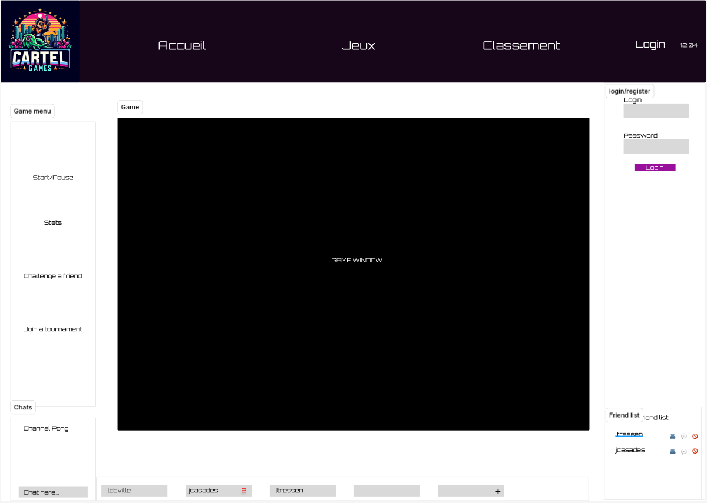

# ft_transcendence

Il faut ```git clone``` puis lancer la commande :
``` docker compose up --build ```

Et ensuite aller sur cet url :
### http://0.0.0.0:8000/

# Website design placeholder



In collaboration with [@LucasDeville](https://github.com/LucasDeville), [@saezito](https://github.com/SAEZITO), [@Thawnder](https://github.com/Thawnder), [@jordancasadessus](https://github.com/jordancasadessus) and [@Paloouf](https://github.com/Paloouf)
